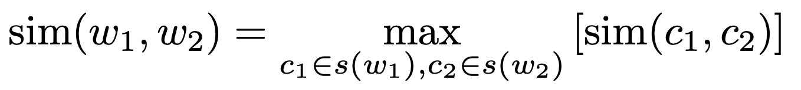
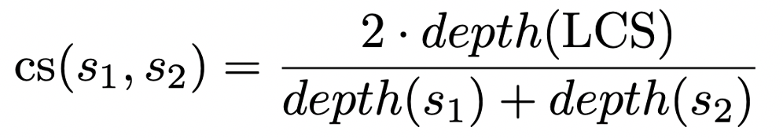
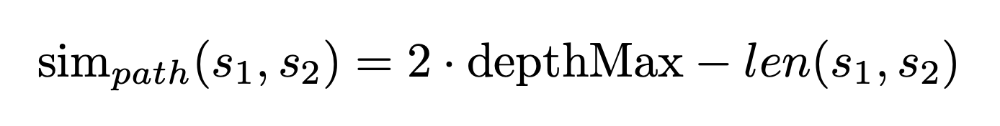
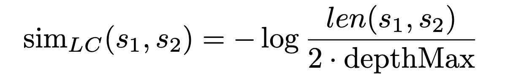

# Concept similarity

## Requirement
L'esercitazione consiste nell'implementare tre misure di similarità basate su WordNet.

Per ciascuna di tali misure di similarità, calcolare gli indici di correlazione di Spearman and gli indici di correlazione di Pearson fra i risultati ottenuti e
quelli ‘target’ presenti nel file annotato.

Per calcolare la similarity fra 2 termini immaginiamo di prendere la massima similarity fra tutti i sensi del
primo termine e tutti i sensi del secondo termine.
- l’ipotesi è cioè che i due termini funzionino come contesto di disambiguazione l’uno per l’altro.
- nella formula c sono i concetti che appartengono ai synset associati ai termini w1 e w2.

  

### WU & Palmer

La similarità di WU & Palmer è definita dalla seguente formula:

  

 
Dove **depth(x)** indica la profondità di uno degli alberi dei nomi di WN a cui si trova il termine x.
LCS è il primo antenato in comune tra 2 sensi ovvero risalendo l’albero tassonomico della gerarchia dei nomi il primo nodo genitore comune tra i 2 sensi. Depth rappresenta il livello di profondità dell’albero a cui si trova quel determinato nodo.

### Shortest Path

  

- Per ogni versione specifica di WordNet, **depthMax** è un valore fissato.
- La similarità tra i due sensi (s1,s2) è funzione del percorso più corto tra i due sensi **len(s1,s2)**
- se **len(s1,s2)** è 0, sim_path(s1,s2) è il massimo valore **2*depthMax.**
- se len(s1,s2) è 2* depthMax, sim_path(s1,s2) è il valore minimo **0**.
- quindi il valore di sim_path(s1,s2) è compreso tra 0 e 2*depthMax. 

### Leakcock & Chodorow

Quando s1 e s2 hanno lo stesso senso, len(s1,s2) = 0. A livello pratico, si aggiunge 1 sia a len(s1,s2) sia a 2*depthMax in modo da evitare log(0)
Quindi il valore di simLC(s1,s2) è compreso nell'intervallo **(0, log(2 * depthMax + 1))**

  

## Implementation

Ogni misura di similarità è stata implementata come una funzione che prende in input 2 parametri **(w1 = Synset, w2 = Synset)**. 
La funzione calcola per ogni coppia di sensi s1 e s2, tale che appartengono rispettivamente ai synset di w1 e w2, il valore di similarità tra di loro ritornando il massimo valore calcolato.

### WU & Palmer

Viene calcolato il **Lowest Common Hyperonym (LCS)** tra i due sensi s1 e s2 con la funzione `find_LCS(s1,s2)`. 
L'antenato comune ritornato dalla funzione è calcolato creando 2 insiemi contenenti rispettivamente gli iperonimi di si e di s2.
Vengono trovati gli iperomini comuni tramite l'intersezione dei 2 insiemi e successivamente ordinati in base al valore restituito dalla funzione `max_depth()` (The length of the longest hypernym path from this synset to the root).  
La lista risultante viene invertita e viene restituito il senso in prima posizione, ovvero l'iperonimo comune ai 2 sensi come la minore `max_depth()`. 
Nel caso in cui non ci sia antenato comune, la similarità è 0, altrimenti si calcola con la formula sottostante.

~~~~python
    sim = 2 * lcs.depth() / (s1.depth() + s2.depth())
~~~~
 - `depth()` = La lunghezza del percorso minimo da questo synset alla radice.

### Shortest Path

Per la versione corrente di WordNet la profondità massima degli è pari a **20**. Ottenibile dalla seguente funzione:
~~~~python
    return max(max(len(path) for path in sense.hypernym_paths()) for sense in wn.all_synsets())
~~~~
La similarità tra i due sensi (s1,s2) è il percorso più corto tra i due sensi attraversando uno degli alberi di Wordnet.
Il valore è ottenibile dalla funzione `len_path(s1,s2)`, che dati in input i sensi s1 e s2 :
 - ritorna 0 se s1 è uguale a s2.
 - calcola l'LCS e ritorna la somma della distanza tra s1 e LCS e s2 e LCS.
Ottenuta la lunghezza del percorso minimo tra i 2 sensi s1 e s2 la si confronta con la distanza tra tutti sensi s1 appartenti a w1 e i sensi s2 appartenti a w2, salvandosi il valore minore (**min_lenth**).
Il valore ritornato dalla funzione è il seguente:
~~~~python
    return 2 * MAX_DEPTH - min_length
~~~~

### Leakcock & Chodorow

Dati i sensi s1 e s2 si calcola `len = len_path(s1,s2)` e si applica la seguente formula.
~~~~python
    if len > 0:                
        sim = -(log(len / (2 * MAX_DEPTH)))
    else:
        sim = -(log(len + 1 / (2 * MAX_DEPTH + 1)))
~~~~
La funzione ritorna il massimo valore di similarità fra ogni coppia di sensi

## Results
	
Similarity index | Spearman index | Pearson index |
------------ | :------------: | :-------------:
| | 
| |
Wu & Palmer | 0.3179 | 0.2617
Shortest Path | 0.2127 | 0.0877
Leakcock & Chodorow | 0.2127 | 0.1951

## Authors

- Iodice Franesco
