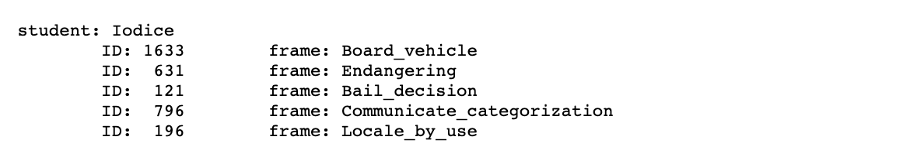

# Mapping di Frame in WN Synsets

## Requirement 

0. Individuazione di un set di frame
Come prima operazione ciascuno deve individuare un insieme di frame (nel seguito riferito come FrameSet) su cui lavorare.
A tale fine utilizzare la funzione getFrameSetForStudent(cognome); nel caso il gruppo sia costituito da 2 o 3 componenti, utilizzare la funzione per trovare il set di frame per ciascuno dei componenti del gruppo.

1.Per ogni frame nel FrameSet è necessario assegnare un WN synset ai seguenti elementi:
- **Frame name** (nel caso si tratti di una multiword expression, come per esempio
'Religious_belief', disambiguare il termine principale, che in generale è il sostantivo se l'espressione è composta da NOUN+ADJ, e il verbo se l'espressione è composta da VERB+NOUN; in generale l'elemento fondamentale è individuato come il reggente dell'espressione.
- **Frame Elements (FEs)** del frame; 
- **Lexical Units (LUs)**.
I contesti di disambiguazione possono essere creati utilizzando le definizioni disponibili (sia quella del frame, sia quelle dei FEs), ottenendo Ctx(w) , il contesto per FN terms w .
Per quanto riguarda il contesto dei sensi presenti in WN è possibile selezionare glosse ed esempi dei sensi, e dei loro rispettivi iponimi e iperonimi, in modo da avere più informazione, ottenendo quindi il contesto di disambiguazione Ctx(s) .

2. Il mapping può essere effettuato utilizzando (almeno) uno fra i due approcci descritti nel seguito.
- **Approccio a bag of words**, e scelta del senso che permette di massimizzare l'intersezione fra i contesti. In questo caso lo score è calcolato come
sarà selezionato il senso che massimizza lo score(s,w).
- **Approccio grafico**. In questo caso si procede con la costruzione di un grafo che contiene
tutti i synset associati ai termini in Framenet (FN). Ogni termine w appartenente ai FEs o alle LUs del frame viene mappato su un senso s di WordNet (WN nel seguito). Il mapping corrisponde all'argomento (su tutti i sensi s associati a w in WN) che massimizza la probabilità condizionata di ottenere il senso s dal termine w:

3. La valutazione dei risultati del mapping è fondamentale. A questo fine è necessario annotare con WN synset ID (ed eventualmente uno o due termini del synset) tutti gli elementi da mappare.
La correttezza dell'output del sistema sviluppato è da calcolare in rapporto all'annotazione effettuata manualmente. Quindi l'annotazione costituisce un elemento molto importante nello svolgimento dell'esercitazione.
Il programma implementato dovrà quindi fornire anche la funzionalità di valutazione, che confronterà i synset restituiti in output dal sistema con quelli annotati a mano dalla studentessa o dallo studente; su questa base deve essere calcolata l'accuratezza del sistema, semplicemente come rapporto degli elementi corretti sul totale degli elementi.

## Implementation

Il set di frame su cui lavorare, estratto dal cognome 'Iodice' è il seguente:

  

Un **frame** da annotare nel programma è rappresentato come un lista con 3 elementi:
- **frame[0]:** mappa in cui per chiave c'è il **frame name** e per valore il synset da mappare.
- **frame[1]:** mappa in cui per chiavi ci sono i **frame element** e per valori i synset da mappare.
- **frame[2]:** mappa in cui per chiavi ci sono le lexical unit e per valori i synset da mappare.

Per le multiword expression è stato utilizzato **spacy** al fine di trovare la radice della multiword è usarla come termine principale da disambiguare.

Il mapping è stato eseguito utilizzando **l'algoritmo di lesk** precedentemente implementato, passando come parametri:
- **word:** frame name, frame element o lexical unit
- **sentence:** definizione relativa a word presente in Framenet

L'annotazione effettuata manualmente è nel file `utils/framenet_data.txt`.
Nel file `result.txt` è presente un confronto fra i sensi inferiti dal programma e quelli annotati manualmente.

### Result

Operation | Accuracy 
------------ | :------------: 
| | 
Mapping | 72% 

## Authors

- Iodice Franesco