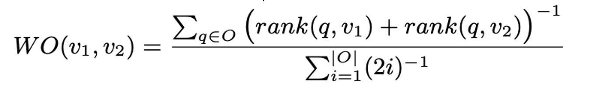

# Automatic summarization

The goal of text summarization is to produce an abridged version of a text which contains the important or relevant information. 

Reduce the document size of e.g., 10%, 20%, 30%

1. individuate the topic of the text being summarised; the topic can be referred to as a (set of) NASARI vector(s):

`vt1 = {term1_score, term2_score, …, term10_score }`
`vt2 = {term1_score, term2_score, …, term10_score }`

2. create the context, by collecting the vectors of terms herein (this step can be repeated, by dumping the contribution of the
associated terms at each round);

3. retain paragraphs whose sentences contain the most salient terms, based on the Weighted Overlap, WO(v1,v2)
    - rerank paragraphs weight by applying at least one of the follow approaches (title, cue, phrase, cohesion) 

## Requirement
L'esercitazione consiste nello sviluppare un algoritmo estrattivo che permette di ridurre le dimensioni del documento del 10, 20 e 30%, andando i rimuovere i paragrafi meno salienti per il testo.
I paragrafi più i devo essere rankati con almeno uno dei seguenti approcci 
- titolo
- frase
- coesione

E' necessario conservare i paragrafi contenenti i termini più salienti in base alla Weighted Overlap.

## Implementation

L' algoritmo che effettua la riduzione del testo prende in input 3 parametri: 
- `compression_rate` percentuale di compressione
- `text` il testo da riassumere rappresentato da una lista di paragrafi
- `nasari` mappa in cui per chiave ci sono i lemmi e per valore il vettore nasari corrispondente

Dalla `compression_rate` viene calcolano il numero massimo parole che devono essere nel riassunto dopo il testo ha subito il processo `target_num_words`.
L'algoritmo di compressione effettua i seguenti step ad ogni iterazione:
 - calcola la frequenza di ogni parola nel testo ordinandole in base alle occorrenze
 - da nasari estrae tutti i vettori associati alle prime 10 parole più frequenti
 - effettua il rank di tutti i paragrafi secondo le seguenti metriche:
    - **coesione**
    - **weighted overlap** con le parole più frequenti
    - **titolo**
 - il risultato di ogni ranking è un vettore di lunghezza uguale al numero di paragrafi del testo e nella posizone i-esima è presente la valutazione del paragrafo i-esimo.
 - effettua la somma dei 3 vettori ottenendo `sum_ranks` in cui per ogni cella i c'è la somma di tutti i rank calcolati per il paragrafo i-esimo.
 - rimuove il paragrafo i-esimo dove i è la posizione con il valore minore in sum_ranks.
La condizione di stop è che numero di parole presenti nel testo è inferiore `target_num_words`.

#### Ranking 

Le funzioni ranking ritornano un vettore con dimensione pari al numero di paragrafi, e in ogni cella i c'è il valore di rank per il paragrafo i
 
#### Ranking cohesion
Per ogni paragrafo vengono salvati i termini rilevati filtrando le stopword.

La funzione scansiona tutti i paragrafi una seconda volta per vedere in che modo correlano i termini rilevanti per il **paragrafo i** con i termini rilevanti del **paragrafo i+1**, calcola l'intersezione tra i termini rilevanti del paragrafo i e quello i+1. La cardinalità dell'insieme è uguale al valore di rank del paragrago i.

~~~~python
coesione_rank[i] = len(intersection(terms_relevance_paragraph_i, terms_relevance_paragraph_i+1))
~~~~

#### Ranking title

Per ogni parola nel titolo si conta quanta volte occorre nel paragrafo i-esimo
~~~~python
for word in keywords:
    occurences += paragraph.lower().count(word.lower())
title_ranks[i] = occurences
~~~~
#### Ranking weighted overlap

Il rank di ogni paragrafo è dato dalle somme dei valori di similarità tra ogni suo termine e ogni termine presente nell'insieme `contex`.
Quindi per ogni termine t presente nel paragrafo avremo:
- **rank(t)** = sommatoria fra le similarità tra il termine t ed ogni parola presente nel `contex`. 
Successivamente viene calcolato:

- **rank(p)** = la sommatoria di ogni rank(t) per ogni t presente nel paragrafo p.

La funzione che calcola la similarità tra 2 termini `sim(w1,w2)` calcola il valore per ogni coppa di sensi s1 e s2 appartenenti rispettivamente a w1 e w2 con il **weighted overlap** ritornando il massimo valore calcolato.

  

La formula è stata implmentata come segue
~~~~python
# Input
def weighted_overlap(w1, w2):
    O = set(w1.keys()).intersection(w2.keys())
    # O is the set of the overlap dimension between 2 vector
    rank_acc, den = 0, 0
    if len(O):
        for i, q in enumerate(O):
            den += 1. / (2 * (i + 1))
            # ( rank of q in_w1 + rank of q in_w2 ) ^ (-1)
            rank_acc += 1. / (rank(q, [(v, k) for k, v in w1.items()]) + 
                              rank(q, [(v, k) for k, v in w2.items()]))
        return np.sqrt(pow(rank_acc, -1) / den), O
    else:
        return 0.0, O
~~~~

La funzione **rank(q,v)** restituisce il rank dell'elemento `q` in `v`.
 - `v` è un vettore di termini ordinati in base alla loro rilevanza
Il valore restitutio della funzione è l'indice dell'elemenento `q` in `v`.

I valori ottenuti per ogni paragrafo sono stati compressi, in modo da ridurre l' intervallo da **[0:50]** a **[0:5]**. 
Questo perchè i valori di rank restituiti dalle altre 2 metriche si trovano in un intervallo **[0:5]** e senza una compressione dei valori il **WO** avrebbe apportato un contributo sbilanciato al ranking totale del paragrafo.

## Results

Nella cartella `texts_summeridez` sono presenti i risultati ottenuti dai testi proposti, applicando una compressione del 20%. 

## Authors

- Iodice Franesco
