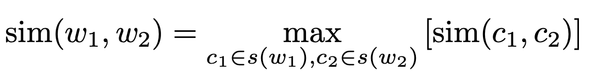
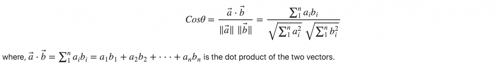
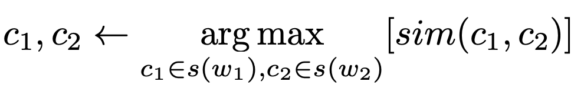

# TLN1920

Il file SemEval17_IT_senses2synsets.txt contiene il mapping da termini a synset corrispondenti. Può essere ottenuto interrogando direttamente BabelNet con i termini delle coppie in input.

Il file mini_NASARI.tsv contiene i vettori presenti in NASARI embed per i synset elencati nel file precedente. Non per tutti i synset elencati nel primo file è presente una descrizione vettoriale.

## Consegna 1: Annotazione valori similairità
La prima operazione consiste nell’annotare con punteggio di semantic similarity 50
coppie di termini.
- **4: Very similar** -- The two words are synonyms (e.g., midday-noon).
- **3: Similar --** The two words share many of the important ideas of their meaning but
include slightly different details. They refer to similar but not identical concepts (e.g., lionzebra).
- **2: Slightly similar --** The two words do not have a very similar meaning, but share a
common topic/domain/function and ideas or concepts that are related (e.g., house-window).
- **1: Dissimilar --** The two items describe clearly dissimilar concepts, but may share some
small details, a far relationship or a domain in common and might be likely to be found
together in a longer document on the same topic (e.g., software-keyboard).
- 0: Totally dissimilar and unrelated -- The two items do not mean the same thing and are
not on the same topic (e.g., pencil-frog)

Annotare 50 coppie di termini del file
 - it.test.data.txt
con il punteggio di similarità fra i due elementi della coppia. Le 50 coppie (sul totale di 500 coppie presenti nel file) sono da individuare
sulla base del cognome, tramite la funzione definita nel notebook
semeval_mapper.ipynb. L’output della prima consegna è un file (in formato tsv) di 50 linee,
ciascuna contenente un numero in [0,4].

La valutazione dei punteggi annotati dovrà essere condotta in rapporto
alla similarità ottenuta utilizzando i vettori NASARI (versione
embedded; file mini_NASARI.tsv, nel materiale della lezione).
- Si tratta di vettori distribuzionali (saranno trattati diffusamente nella terza parte
del corso); li utilizziamo massimizzando la cosine similarity al posto della
generica funzione sim(c1, c2)

  

Massimizzazione della cosine similarity al posto della generica funzione sim(c1, c2)

  

La valutazione della nostra annotazione è condotta calcolando i coefficienti di Pearsons e Separman fra (la media dei) i punteggi annotati a mano e
quelli calcolati con la versione embedded di NASARI.

### Consegna 2 Annotazione dei sensi

Il secondo compito consiste nell’individuare i sensi selezionati nel
giudizio di similarità.

La domanda che ci poniamo è la seguente: quali sensi abbiamo effettivamente utilizzato quando abbiamo assegnato un valore di
similarità a una coppia di termini (per esempio, società e cultura)?
- NB: questa annotazione, sebbene svolta successivamente a quella della prima
consegna, deve essere coerente con l’annotazione dei punteggi di similarità.
Per risolvere questo compito partiamo dall’assunzione che i due termini funzionino come contesto di disambiguazione l’uno per l’altro.

L’output di questa parte dell’esercitazione consiste in 2 Babel synset ID
e dai termini del synset.Il formato di output è quindi costituito da 6 campi (separatore fra campi a tabulazione, mentre usiamo la virgola ‘,’ come separatore all’interno dello
stesso campo):
- Term1 Term2 BS1 BS2 Terms_in_BS1 Terms_in_BS2
- macchina bicicletta bn:00007309n bn:00010248n
    auto,automobile,macchina bicicletta,bici,bike

Valutiamo il risultato ottenuto (cioè la coppia dei sensi identificati, e la
relativa appropriatezza) in rapporto all’output di un semplice sistema
realizzato come segue
- Utilizziamo nuovamente i vettori NASARI (versione densa, embedded)
presenti nel file mini_NASARI.tsv, disponibile all’interno del materiale della
lezione.
• NB: il file contiene soli i vettori per i synset associati ai termini delle coppie; NON tutti i
termini delle coppie hanno un vettore…
- Con tali vettori calcoliamo la coppia di sensi che massimizzano lo score di
similarità

  

• Misuriamo in questo caso l’accuratezza sia sui singoli elementi, sia sulle
coppie.

## Implementation
La funzione presente nel file `semeval_mapper.ipynb` data come string in input 'Iodice' restituisce il seguente intervallo:
 - Iodice : coppie nell'intervallo 251-300

Dal file `SemEval17_IT_senses2synsets.txt` che contiene il mapping da termini a synset corrispondenti, è stata creata una mappa `sense2syn` con chiavi i diversi termini e per valori la lista di bable synset corrispondenti.
Dal file `mini_NASARI.tsv` è stato realizzata una mappa che per chiavi ha i diversi bable synset è per valori la coppia (name, vector):
- **name**: lemma del bable synset
- **v** : vettore embed corrispondente

L'annotazione di similarità fra coppie di termini effettuata manualmente è visibile nel file `valsim_annotated.txt`.
La valutazione dei punteggi manuali fra 2 termini w1 e w2 è stata effettuata confrontandolo con il massimo valore della **cosine similarity** calcolato per i sensi di s1 e s2 appartenenti rispettivamente a w1 e w2, implementata come segue:

~~~~python
def get_max_similarity(w1, w2, nasari, sense2syn):
    max_sim = 0
    for c1 in sense2syn[w1]:
        for c2 in sense2syn[w2]:
            if c1 in nasari and c2 in nasari:
                nasari_vect_w1 = nasari[c1]
                nasari_vect_w2 = nasari[c2]
                sim = cos_similarity(nasari_vect_w1['v'], nasari_vect_w2['v'])
                if sim > max_sim:
                    max_sim = sim
    return max_sim

def cos_similarity(v1, v2):
    dot_product = np.dot(v1, v2)
    norm_a = np.linalg.norm(v1)
    norm_b = np.linalg.norm(v2)
    return dot_product / (norm_a * norm_b)
~~~~

I coefficienti di correlazione di Spearman e Pearson relativi ai valori annotati a mano e quelli calcolati dall cosin similarity sono i seguenti:
 - **Pearson** correlation coeffcient : **0.6625**
 - **Spearman** correlation coeffcient : **0.7047**

Per quanto riguardo la consegna 2, l'annotazione manuale è nel file `bid_annotated.txt`, ogni riga del file rispetta il pattern:
- **Term1 Term2 BS1 BS2 Terms_in_BS1 Terms_in_BS2**

Dove **Term1 Term2** sono la coppia di termini presenti anche nel file `valsim_annotated.txt` , **BS1** e **BS2** sono i bable synset annotati manualmente corrispondenti ai sensi dei termini **Term1 Term2**.

Per estrarre i sensi di **Term1 e Term2** che massimizzano la cosine similarity è stata usata una funzione analoga alla precedente, che oltre al massimo valore per coppia di sensi restituisce i sensi che lo massimizzano.

Individuati i synset viene utilizzata la seguente funzione per estrarre i primi 5 termini presenti nel bable synset passato come parametro.

~~~~python
def get_terms_in_synset(synset):
    terms_list = []
    res = requests.get('https://babelnet.io/v5/getSynset?id={}&key={}'.format(synset, KEY_BN))
    response = res.json()
    if 'senses' in response:
        senses_list = response['senses']
        for s in senses_list:
            if s['type'] == 'WordNetSense' or s['type'] == 'BabelSense':
                terms_list.append(s['properties']['fullLemma'])
    #return first 5 terms
    return terms_list[:5]
~~~~

Di seguito l'accuratezza calcolata sia sul numero giusto di bable synset inferiti che sulle coppie:
 - **Term** accuracy : **26.66**
 - **Coplues** accuracy : **38.33**
 
 Nel file result.txt è presente una lista di tutti i bable sysnet annotati confronati con quelli inferiti dal programma con i relativi punteggi di similarità sia manuali che calcolati dal programma.