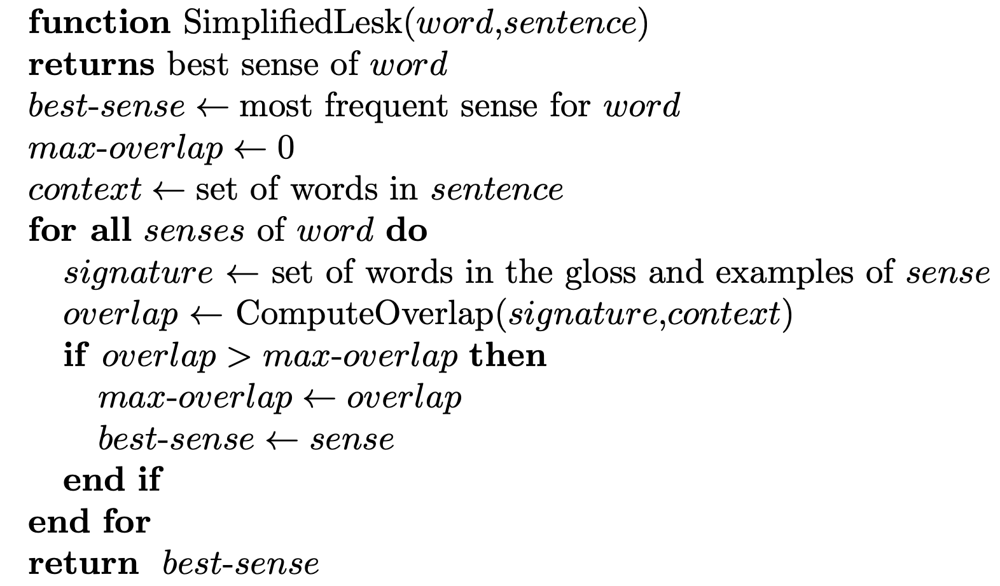

# WSD

Word sense disambiguation (WSD) is an open problem of natural language processing, which comprises the process of identifying which sense of a word (i.e. meaning) is used in any given sentence, when the word has a number of distinct senses (polysemy).

Disambiguating word senses has the potential to improve many natural language processing tasks, such as machine translation, question-answering, information retrieval, and text classification.
In their most basic form,WSD algorithms take as input a word in context along with a fixed inventory of potential word senses, and return as output the correct word sense for that use.

One approach to the task is the bag-of-words. 
A **bag-of-words** means an unordered set of words, ignoring their exact position.
- the simplest bag-of-words approach represents the context of a target word by a vector of features, each binary feature indicating whether a vocabulary word w does or doesn’t occur in the context.

By far the most well-studied dictionary-based algorithm for sense disambiguation is the Lesk algorithm.

## Requirement 
- Implementare l'algoritmo di lesk con l'approccio bag-of-word 
- Estrarre 50 frasi dal corpus SemCor (corpus annotato con i synset di WN) e disambiguare almeno un sostantivo per frase. Calcolare l’accuratezza del sistema implementato sulla base dei sensi annotati in SemCor.

### Lesk
Di seguito lo pseudocodice dell'algoritmo:

  

## Implementation

Di seguito l'implementazione realizzata:

~~~~python
def lesk_algorithm(word, sentence):
    senses = wn.synsets(word)
    if len(senses) == 0:
        return None
    else:
        best_sense = wn.synsets(word)[0]
        max_overlap = set()
        context = filter_stopword_from_sentence(sentence)
        for sense in wn.synsets(word):
            signature = get_wordnet_ctx(sense)
            overlap = intersection(signature, context)
            if len(overlap) > len(max_overlap):
                max_overlap = overlap
                best_sense = sense
        return best_sense 
~~~~

1.`filter_stopword_from_sentence(sentence)` : ritorna una set con i termini presenti nella frase escluse le stopword

2.`get_wordnet_ctx(sense)`: ritorna un set senza stopword con tutti i termini presenti:
 - negli esempi di `sense`
 - nella definizione di `sense`
 - nelle definizioni di tutti gli iponimi di `sense`
 - nelle frasi degli esempi di tutti gli iponimi di `sense`
 - nelle definizioni di tutti gli iperonimi di `sense`.
 - nelle frasi degli esempi di tutti gli iperonimi di `sense`.

3.`intersection(signature, context)`: ritorna l'intersezione tra i 2 insiemi

### Result

Il sistema è stato valutato confrontando il senso inferito dall'algoritmo di lesk con quello annotato presente nel corpo SemCor.

Version WSD | Accuracy 
------------ | :------------: 
| | 
| |
WSD nltk | 38% 
WSD implemented | 64%

## Authors

- Iodice Franesco